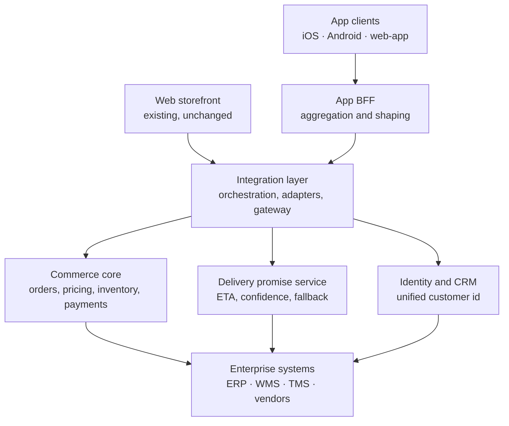
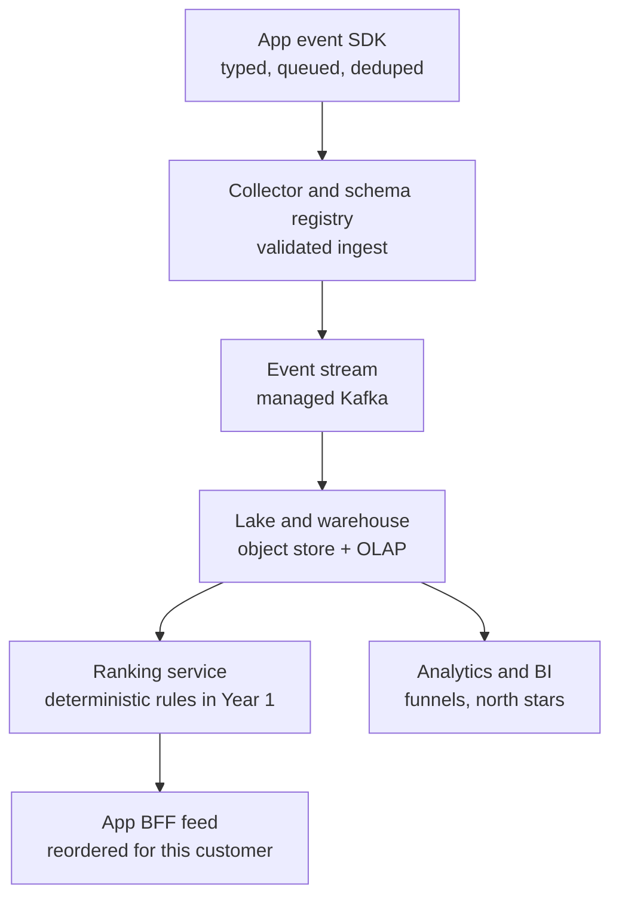

# Deliverable 2 — Overall system design

## The principle this design serves

> In Year 1 the app's job is not to sell. It is to convert anonymous web buyers into known
> customers and to remove the "where is my order?" question. Every architectural choice below is
> judged on whether it produces trustworthy first-party signal and a delivery promise customers
> believe. AI is the payoff of that signal, not a Year 1 feature.

Everything I defer, I defer because it does not serve that sentence yet.

## Two paths, not one diagram

The system has two paths with different latency budgets, different failure modes and different
consistency requirements. Drawing them as one picture hides exactly the parts that are hard.

- **Request path** — synchronous, p95 budget ~400 ms, must degrade rather than fail.
- **Signal path** — asynchronous, at-least-once, must never lose or duplicate a user action.

### Request path

### Signal path

Note what is absent from the signal path: there is no model. That is the answer to "where does ML
sit and where does it not". See *Where ML does not go* below.

## Layer by layer

### 1. App client

React Native across iOS and Android, with the web-app served from the same codebase via RN Web
where the surface allows it. One rendering model, one design system, one event SDK — the
alternative is three implementations of the same tracking logic and therefore three different
versions of the truth.

- **On device**: feed rendering and virtualisation, image caching, the offline event queue, the
  last-good feed snapshot, and the HomeByMe room scan (ARKit RoomPlan / ARCore) because raw depth
  data should never leave the phone.
- **Server side**: ranking, pricing, availability, delivery promise, and anything a merchandiser
  needs to change without an App Store release.
- **State and identity**: a single `anonymous_id` minted at first launch and persisted in secure
  storage, promoted to a `customer_id` at login. Session state is client-owned; identity is
  server-owned. The app never treats a locally cached customer id as authoritative for pricing or
  entitlements.

### 2. Backend-for-Frontend

One BFF, owned by the app team, schema-first. The contract is defined once and TypeScript clients
are generated for the app, so a breaking change is a compile error rather than a production crash.

Responsibilities: aggregate the four or five core calls a feed render needs into one round trip;
shape responses for the surface rather than the domain; enforce per-source timeouts; own the
degradation policy; attach a `feed_request_id` so client-side impressions can be correlated with
what the server actually ranked.

Explicitly **not** its responsibilities: business rules, pricing logic, order state. If a rule
would also be true on the web, it belongs deeper.

The web storefront does not pass through this BFF. The reference architecture implies a shared
path; I would not do that. A BFF exists to serve one client family with one latency budget. Share
it with the web and you re-inherit the caching model and coupling the app was meant to escape.
Two experience layers, one core, applied more strictly than the reference draws it.

### 3. Integration layer

Partial reuse, and it is worth being precise about which parts.

- **Reuse**: existing adapters to ERP, WMS and vendor systems. These are stable, they are
  well-understood, and rewriting them buys nothing.
- **Rewrite**: read orchestration. The current orchestration was written to assemble web page
  loads. App reads have a different shape — one aggregated call, mobile latency, partial results
  acceptable. Retrofitting page-load orchestration into that is slower than writing app-shaped
  orchestration against the same adapters.
- **Gateway**: authentication, rate limiting and quota enforcement stay shared. There is no
  argument for a second auth implementation.

### 4. Commerce core and delivery promise

The commerce core — orders, pricing and promotions, inventory, payments — is reused as-is. It is
the most stable thing Sklum owns and the whole point of a shared core.

**I would extract delivery promise from it.** The reference architecture lists delivery-promise
logic inside the stable core; I do not think it belongs there. It is the only component whose
correctness depends on WMS, TMS and third-party vendor lead times simultaneously; it is the thing
the Year 1 north star actually rests on; and it gets structurally harder as the catalogue widens
into kitchens, appliances and outdoor, where fulfilment paths differ. Giving it its own service
buys three things:

1. Its own cache and its own staleness policy, independent of order data.
2. An explicit confidence level in the API contract (`high` / `medium` / `low`) so the client can
   show a date, a window, or an honest "we'll confirm within 24h" instead of guessing.
3. Its own failure domain. A slow TMS should widen the promise, not fail the product page.

The rule I would hold the team to: a wider honest window costs less trust than a confident wrong
date.

### 5. Identity and CRM

Shared, reused, and the hardest correctness problem in the system. One unified customer id across
web and app, with anonymous-to-known resolution handled as an append-only event rather than a
mutation. When an anonymous visitor logs in, the app emits an identity-resolution event linking
the two ids; downstream, history is stitched by joining through a resolution table. Nothing is
rewritten in place, so a bad merge is reversible.

Post-purchase is the highest-yield identification moment — a customer who wants to track an order
will authenticate to do it. That is the mechanism behind the known-customer-share metric, and it
is a product decision as much as an architectural one.

### 6. Tracking and event capture

Covered in depth in Deliverable 3 — this is my chosen domain. Summary of the position: event
correctness is a client-side problem, not a pipeline problem. No amount of warehouse
deduplication recovers an event the app never emitted, and no schema check catches an event fired
twice by a double tap. The contract is defined in a shared package, validated at the collector,
and enforced by tests that run in CI.

### 7. Data lake and AI/ML

Buy the infrastructure — managed streaming, object storage, an OLAP engine. There is no
competitive advantage in operating Kafka.

**Where ML does not go, in Year 1**: ranking. Feed ordering is a deterministic scoring function
over captured events, versioned and logged with every response. Three reasons:

- You cannot train a recommender on data you have not collected. Year 1 is when the data is
  created, not when it is exploited.
- If the model ships alongside the event schema, every ranking bug becomes a two-variable
  problem. Getting the pipeline trustworthy first makes the Year 2 model debuggable.
- A rules-based ranker behind a service interface is a drop-in replacement later. The interface is
  the durable asset, not the implementation.

**Where ML does go, early**: demand forecasting and delivery-promise estimation, because those
train on operational data that already exists in ERP/WMS history and do not depend on app signal
maturing first.

## Build, buy, reuse

| Component | Call | Reasoning |
|---|---|---|
| App clients (RN) | Build | No usable existing app surface; this is the product |
| App BFF | Build | Small, app-team owned, changes weekly |
| Integration adapters | Reuse | Stable, well-understood, rewriting buys nothing |
| Read orchestration | Build | Existing orchestration is page-load shaped |
| API gateway / auth | Reuse | No case for a second auth implementation |
| Commerce core | Reuse | The most stable asset Sklum owns |
| Delivery promise | Extract and build | Different failure domain, different cache, own confidence model |
| Identity and CRM | Reuse | Must be shared or the whole case collapses |
| Event SDK and contracts | Build | The correctness properties are specific to this system |
| Collector, stream, lake | Buy | Commodity infrastructure |
| Analytics and BI | Buy | Commodity |
| Ranking service | Build (rules Y1, model Y2) | Interface is durable; implementation is not |
| Conversational discovery | Buy foundation model, build orchestration | Year 3; no reason to train from scratch |
| HomeByMe 3D pipeline | Buy engine, build catalogue integration | Asset pipeline is the real work, not the renderer |

## The three hard parts

**1. Identity stitching.** Anonymous install to known customer, reconciled with existing web
history, without merging two people who share a tablet or splitting one person across devices.
This single problem determines whether "share of known and understood customers" is a real metric
or a vanity one. Mitigation: append-only resolution events, reversible merges, and a monitored
merge-rate metric that alerts on anomalies rather than a silent best-effort join.

**2. Delivery promise accuracy under catalogue expansion.** A sofa from a Spanish warehouse and a
tailored kitchen from a vendor have nothing in common operationally. Mitigation: confidence levels
in the contract from day one, so widening the window is a supported state rather than an incident,
and a measured promise-vs-actual delta as a first-class dashboard.

**3. Event correctness at the edge.** Mobile clients are lossy — offline, backgrounded, killed
mid-session, retried on reconnect. Exactly-once-per-user-action has to be solved on the device
with client-generated idempotency keys and a durable queue. Mitigation: this is what the prototype
demonstrates, including the failing case.

## Assumptions

Stated and moved past, per the brief:

- GMV in the mid-hundreds of € millions; treated as ~€400M for modelling.
- Existing commerce core exposes serviceable APIs; the fragility is in the presentation and
  orchestration layers, not the domain services.
- No existing structured event pipeline of usable quality — the app is the first clean source.
- Team size in Year 1 is small. Every "build" above is justified against that constraint, which
  is why the buy column is as long as it is.
