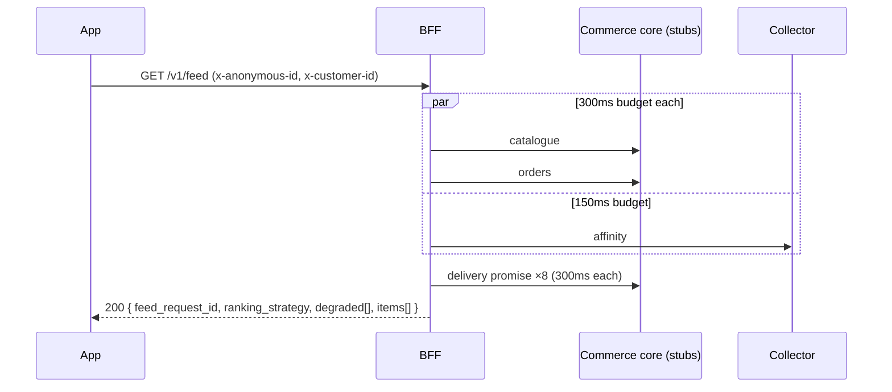
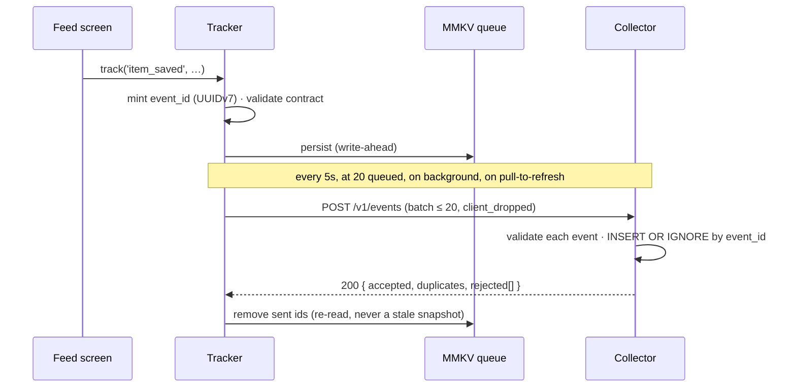

# Deliverable 3 — Domain deep-dive and prototype

## The domain: app client, BFF and event capture, as one vertical

I chose this seam for three reasons, and since the brief says the choice is itself a signal, here
they are plainly.

1. **It is where I am strongest.** React Native, TypeScript and mobile-optimised API design are
   what I have done for eight years, including offline-first data layers in production.
2. **It is where "AI-first foundation" is either true or hand-waving.** The system design claims
   that event correctness is one of the three hardest problems in the system. This slice tests
   that claim against running code rather than a diagram.
3. **It is the smallest slice that closes the whole loop.** A tap becomes an event, the event
   becomes a stored signal, the signal changes what the customer sees next. Every layer of the
   overall design is touched by that loop, so going deep here does not mean ignoring the rest.

## What the prototype proves

| Business-case claim | Evidence in the repo |
|---|---|
| Signal captured from day one is trustworthy | 12 event-correctness tests, mutation-checked (see Deliverable 4) |
| The feed adapts to behaviour without a model | `rules_v1` reorders from captured saves and taps; tested and demoable |
| Delivery trust survives infrastructure failure | Orders down or promise slow → 200, honest copy, never a guessed date |
| Known-customer share is measurable and correct | Anonymous → known stitching with no row rewritten; shared-device sign-out tested |
| Repeat opens are countable | `app_opened` on cold start and on every return from background |

## Architecture of the slice

```
apps/mobile            Expo dev build (native, not Expo Go) · RN 0.86 · RTK Query · FlashList · MMKV
  src/tracking/        tracker.ts — platform-agnostic capture engine (no RN imports)
                       impressions.ts — viewability and dedup, pure logic
                       index.ts — RN wiring: MMKV storage, HTTP transport, app lifecycle
packages/events        Zod contract shared by device and collector — the one shared package
services/bff           Hono · GET /v1/feed · 4 upstreams with per-source budgets · rules_v1 ranking
services/collector     Hono · POST /v1/events · GET /v1/affinity · GET /v1/stats · SQLite
services/stubs         Commerce core, orders and delivery promise, with latency and fail switches
tools/analyze          Funnel and data-quality report over the event store
tests/                 End-to-end: real tracker against real collector; BFF over real HTTP
```

### Request path



### Signal path



## The event contract

One envelope, a typed payload per event, defined once in `packages/events` and imported by both
the device and the collector. A client that compiles can only construct events the collector
accepts, and the tracker validates at runtime as well, because a refused event on the device is a
visible bug while a rejected event at the collector is a silent loss.

| Event | Why it exists |
|---|---|
| `app_opened` | Repeat opens — a Year 1 north star. Cold and warm opens both count |
| `feed_viewed` | Ties a render to the ranking strategy that produced it |
| `feed_item_impressed` | Future ranking training data: item, position, dwell |
| `feed_item_tapped` | Relevance signal; carries category so affinity needs no catalogue join |
| `item_saved` / `item_unsaved` | Strongest affinity signal |
| `delivery_promise_shown` | Makes promise-vs-actual measurable — emitted only once actually seen |
| `identity_resolved` | Anonymous → known stitching, append-only |

`feed_request_id` travels on every event from a ranked surface. It is what makes every future
ranking change attributable, and it cannot be backfilled — which is why it is in the contract
from the first version.

## Correctness guarantees and how each is enforced

**Write-ahead.** `track()` persists to MMKV before any network call. The queue survives the app
being killed at any point, including mid-flush.

**Exactly once per user action.** `event_id` is minted at the call site, never at flush time. A
batch resent after a lost acknowledgement carries identical ids; the collector's primary key absorbs
the duplicates. Delivery is at-least-once; the effect is exactly-once. A double tap is two actions
and correctly produces two events.

**No poison pills.** The collector validates events individually, so one bad event never costs the
other nineteen their delivery. Response semantics are explicit: 200 means every event reached a
final state and the device deletes the batch; 400 means the batch can never succeed, so the device
drops and counts it rather than retrying forever; 5xx, 408 and 429 mean back off and retry.

**Bounded, and honest about loss.** The queue caps at 500. Under pressure, impressions and
promise-shown events go first — high volume, individually low value — and saves and identity
events survive. Every drop is counted on device and reported to the collector on the next batch.

**Backoff with jitter.** Exponential from 1s to 60s with equal jitter, so a fleet of devices
reconnecting together does not stampede the collector. Single-flight flushing, so concurrent
triggers share one attempt instead of racing to send the same events twice.

**Clock skew.** The collector keeps the device's timestamp verbatim, clamps it into a 24-hour
window for analysis, and records the skew. A wrongly-timestamped event remains distinguishable from
a genuinely late one.

**Viewability.** An impression requires 50% visibility for at least 500ms, once per item per ranked
feed. Without the dwell floor, a fast scroll past twenty cards reports twenty impressions nobody saw,
and a model trained on that learns that everything is ignored.

## Identity: the hardest correctness problem, handled

Anonymous-to-known resolution is an append-only event. On sign-in the tracker emits
`identity_resolved` from the anonymous identity; the collector records a link; affinity is computed
by joining through the links at read time. No event row is ever rewritten, so a bad merge is
reversible.

**Sign-out rotates the anonymous id.** This is the shared-device case named as a hard part in the
system design. Keeping the old anonymous id after sign-out would attribute the next person's
behaviour to the customer who just left, through the link already on the server. There is a test
for exactly this.

## The BFF: degrade, never fail

Four upstreams, each with its own budget: catalogue, orders and delivery promise at 300ms;
personalisation at 150ms, because an unpersonalised feed now beats a personalised one late.

| Upstream failure | What the customer sees |
|---|---|
| Orders down | "Order tracking" card: *Your order is safe. Pull down to check again.* |
| Promise slow or down | *Delivery estimate updating. Usually within 21 days* — never a guessed date |
| Catalogue down | Banner naming what is missing; everything else still renders |
| Personalisation down | Nothing. The feed is still correct, just not personal — reported, not shown |
| BFF unreachable | Last good feed from MMKV, with an offline notice |

Source names are system vocabulary and never reach the screen; the banner translates them into
what the customer would recognise.

## Ranking, deliberately without a model

```
score = 0.5 · recency (30-day half-life) + 0.3 · category affinity + 0.2 · business boost
affinity = 3 · saves − 3 · unsaves + 1 · taps, per category, last 30 days, identity-stitched
```

Active order cards are pinned above everything. A customer with an order in flight opened the app
to find the order, and that is a product decision that should never be left for a model to
rediscover. Impressions are deliberately excluded from affinity: they are training data for a future
model, and weighting them now would make the feed reinforce whatever it already showed.

The strategy name ships in every response and on every event. That property matters more than the
formula: the formula will be replaced, and when it is, the two can be compared.

## Tests

21 tests across three files, all running in CI in plain Node:

- **Event correctness (12):** offline then reconnect; acknowledgement lost after the server stored
  the batch; process death mid-flush; double tap versus resend; anonymous-to-known without rewrite;
  shared-device sign-out; poison batch; backpressure ordering; contract refusal on device; partial
  batch acceptance; clock clamping; malformed envelope.
- **BFF (5):** happy path with pinned order; orders down; promise over budget, timed; event store
  unreachable; the loop closing — saves move a category to the top of the next ranking.
- **Impressions (4):** one view per ranked feed; dwell floor; dedup within a feed and reset across
  feeds; open views closed on background.

The suite was mutation-checked — three guarantees deliberately broken, each caught. See
Deliverable 4.

## Demo script — four minutes

1. **Open the app signed out.** No order card; a neutral feed.
2. **Sign in.** The order card appears pinned at the top. `identity_resolved` has linked the device.
3. **Save two outdoor pieces, tap a third.** Pull to refresh: outdoor rises to the top.
4. **Stop the collector.** Save three more. The footer shows *3 events waiting to send*.
5. **Force-quit the app and relaunch.** Still 3 waiting — the queue survived process death.
6. **Start the collector, pull to refresh.** The count drains to zero.
7. **Break things.** Fail the orders stub, slow the promise stub. Pull to refresh: the feed
   survives, the copy stays honest.
8. **`npm run report`.** Funnel, promise confidence mix, duplicates absorbed, drops reported.

Signal in, ranking out, no model. The AI-first foundation, executed rather than asserted.

## Seams left visible for the live extension

- **A new card type** is one member on the `FeedItem['type']` union plus one case in `FeedCard`.
- **A new event** is one Zod schema in `packages/events`. Both device and collector pick it up; the
  compiler finds every call site that needs updating.
- **A new ranking strategy** is one function behind `rank()`, named in the response.
