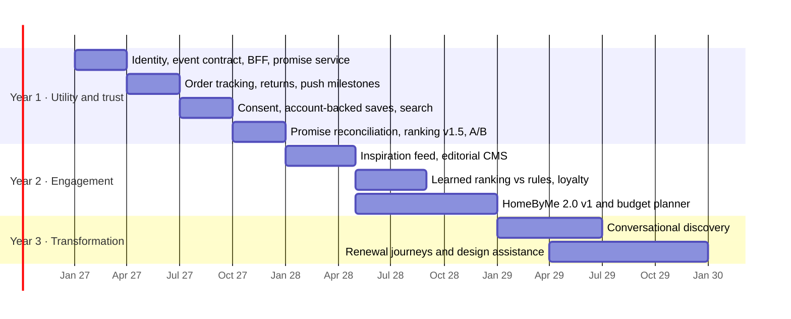

# Deliverable 5 — Three-year roadmap

## The sequencing principle

Sklum's arc runs utility, then engagement, then transformation. The technical reason that order is
correct — not just commercially sensible — is that **each stage consumes data the previous stage
must have started collecting**, and most of that data cannot be backfilled. A learned ranking model
in Year 2 needs a year of impressions with positions and ranking strategy attached. Conversational
design help in Year 3 needs structured product attributes, a trustworthy delivery promise, and
consented life-event signals. None of that can be bought later at any price.

So the roadmap is organised around one question per stage: *what must already be true for the next
stage to be possible?*

## Year 1 — Utility and trust

**The customer's experience.** The app is where you go after you have bought something. It tells
you where your order is, honestly, including when it does not know yet. Returns and rescheduling
take a minute instead of an email. A light feed shows things related to what you bought and saved.
Most customers arrive through a prompt in their order confirmation, not through marketing.

**Technology, in order:**

| Quarter | Ships | Why this order |
|---|---|---|
| Q1 | Identity (anonymous → known), event contract and collector on a streaming path, app BFF, delivery promise extracted into its own service with confidence levels, feed v1 on rules | Everything later reads from these. Ship them before anything a customer notices |
| Q2 | Order tracking, returns and rescheduling, push notifications at delivery milestones | The identification engine — the reason a customer signs in |
| Q3 | Consent management, account-backed saved items, product detail, search (bought, managed) | Consent must precede scale. Search is commodity; buy it |
| Q4 | Promise-vs-actual reconciliation, ranking v1.5 with exploration and diversity, A/B framework | Completes the delivery-trust measurement; makes ranking changes provable |

Checkout stays a hand-off to the existing web flow in Year 1. A native checkout is a large surface
with payment, fraud and regulatory weight, and the Year 1 case does not depend on it. It moves into
Year 2 once the app has an audience worth optimising for.

**Exit criteria**, from the business case: WISMO contacts per app-attached order from 0.22 to 0.16;
identified customers from 35% to 45%; delivery promise met within stated window measured and at or
above 92%; crash-free sessions above 99.5%; post-purchase install conversion at or above 8%. If the
install rate misses 8%, Year 2 does not start as planned — the identification engine has failed and
has to be redesigned first.

## Year 2 — Engagement

**The customer's experience.** Opening the app between purchases becomes worth it. The feed leads
with inspiration — rooms, collections, seasonal edits — shaped by what you have saved and bought. You
can scan a room and see whether a sofa fits before buying it, and plan a whole room against a
budget. Loyalty rewards the things that matter in furniture: free assembly, priority delivery slots.

**Technology:**

- **Learned ranking** behind the same `rank()` interface, A/B-tested against `rules_v1`. The model
  is trained on Year 1's impression logs — which is why `feed_request_id`, position and strategy
  were in the event contract from its first version.
- **Editorial CMS** (bought, headless) so merchandisers can publish inspiration without releases.
- **HomeByMe 2.0 v1:** room capture with RoomPlan on LiDAR-equipped iPhones first, Android ARCore
  after; place catalogue items at true scale; budget planner totals against live pricing and
  delivery promise. Buy the rendering engine, build the catalogue integration.
- **Native checkout** reusing the commerce core's payment APIs, with Apple Pay and Google Pay.
- **One identity across web and app**, extending the Year 1 resolution graph to web sessions.

**Exit criteria:** app at 25% of orders; repeat purchase rate on the app cohort up 7 points,
confirmed against the Year 1 holdout rather than inferred from a self-selected cohort; learned
ranking beating rules on a pre-registered metric.

## Year 3 — Transformation

**The customer's experience.** The app is where known customers start. You can describe what you
want — *a calm reading corner for a small north-facing room, under €600* — and get a proposal that
fits the room you scanned, the style you have shown, and what can actually arrive before you need
it. When life changes — moving, a new child, working from home — the app notices, with permission,
and helps you adapt the space rather than just selling you a product.

**Technology:**

- **Conversational discovery** built on a bought foundation model with Sklum-built orchestration.
  The model never states a price, stock level or delivery date from its own text: those come only
  from tool calls into the commerce core and the promise service. A hallucinated delivery date would
  spend exactly the trust Year 1 was built to earn.
- **Design assistance** combining room scans, style profiles and structured product attributes.
- **Renewal journeys** triggered by consented life-event signals.
- **Demand steering:** ranking that accounts for stock position and promise confidence, so the feed
  favours what can arrive on time as well as what the customer will like.

**Exit criteria:** app at 40% of orders; identified customers at 72%; conversational sessions
converting at or above search sessions.

## Start now, for later

The decisions below cost little in Year 1 and are impossible or very expensive to retrofit.

| Start in Year 1 | Unlocks | Cost of starting late |
|---|---|---|
| `feed_request_id`, position and ranking strategy on every ranked event | Year 2 learned ranking | A year of unusable training data |
| A 5% holdout on the install prompt | Honest Year 2 incrementality | The app's value can never be separated from selection bias |
| Consent and purpose tags on the event contract | Year 3 life-event personalisation | Historical data unusable for new purposes |
| True dimensions and 3D assets for the top 500 SKUs | Year 2 HomeByMe | HomeByMe launches with a catalogue too thin to use |
| Structured attributes — style, material, colour, dimensions | Year 2 ranking features; Year 3 conversational retrieval | The model can only guess from product titles |
| Promise-vs-actual history | Year 2 promise model; demand steering | No baseline to improve against |
| Append-only identity graph | Year 2 cross-device and web unification | Irreversible merges, unrecoverable errors |

## Risks

| Risk | Where it bites | Mitigation |
|---|---|---|
| Identity merges go wrong | Every personalisation stage; privacy | Append-only links, reversible merges, monitored merge rate, sign-out rotation |
| Promise accuracy degrades as the catalogue widens | Year 1 north star | Confidence levels in the contract; wider honest windows; reconciliation from Q4 |
| Install conversion below 8% | The whole Year 1 mechanism | Measure from week one; the Year 2 gate above |
| Consent retrofitted too late | Year 3 entirely | Contract change in Q3 of Year 1, before scale |
| Small team, wide scope | All years | Buy commodity: search, CMS, streaming, rendering engine, foundation model |
| Conversational layer states wrong facts | Year 3 trust | Facts only via tool calls; never from model text |
| 3D asset production cost | Year 2 HomeByMe | Start with the top 500 SKUs; supplier-provided assets in contracts |
| Expo and React Native upgrade cadence | Continuous | Budget an SDK upgrade twice a year; stay on the SDK's pinned versions |

## What is deliberately not on this roadmap

- **A native checkout in Year 1.** The case does not need it, and it is the most expensive surface to
  get right.
- **A trained model before Year 2.** There is nothing to train it on.
- **HomeByMe before the asset pipeline exists.** A room scanner with a thin catalogue is a demo, not
  a product.
- **Community and social features.** The brief mentions community; I would not schedule it inside
  three years. It needs an audience that the first two stages have to build first.
